# AI Air Hockey

**Project Goal**

Our goal is to close the sim to real gap and deploy an AI model to successfully play air hockey against a human. Below is a video of our current progress:


System Overview:

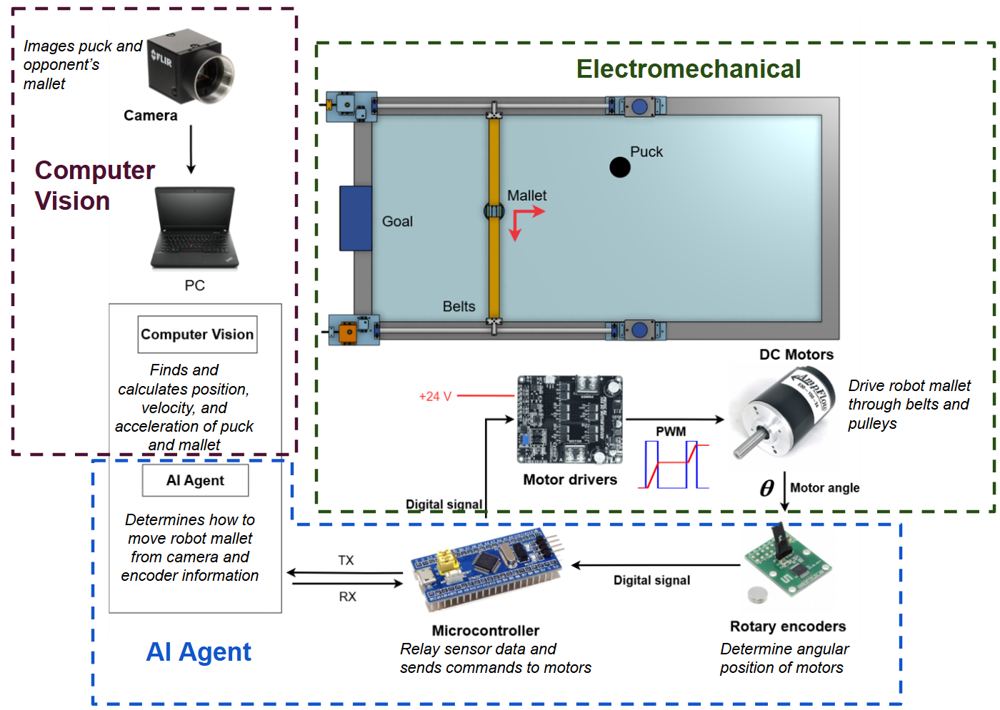

**Challanges**

To acheive this level of preformance, we designed and statistically modeled the real preformance of the table, including the vision accuracry, motor responses to voltage, timing throughout the firmware, and puck dynamics - while adjusting the electromechanical system so our models become more accurate. Using this model we wrote our own vectorized simulation to train a reinforcement learning (RL) agent which was then deployed on the physcial air hockey table.

Below is a video of the main agent (Left) playing against a smaller defence agent (Right).

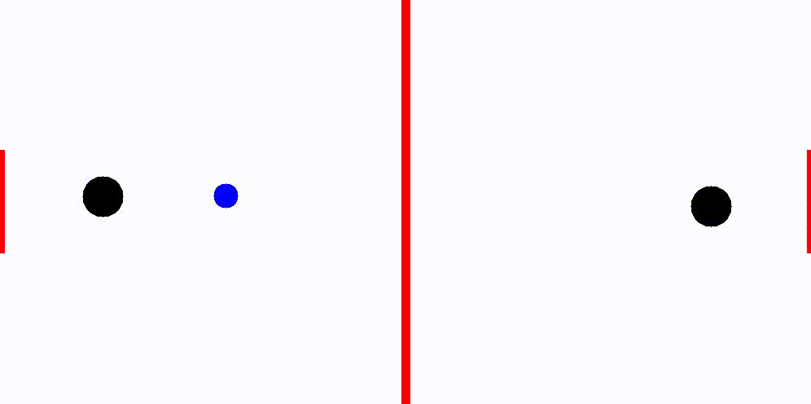

**Report and Details**

The first half of the project (the first 8 months) and its full in depth report is linked below. This covers the simulation design, vision calibrations, and reinforcement learning setup. However, note that much of the content in this final report has since been improved, including the reinforcement learning state space and reward function, as well as puck collision dynamics modeling and firmware.

First Half of Project: [Final Report](docs/2509-AIAirHockey-FinalReport.pdf)

Below we give short outlines for each system, many of the technical details are outlined in the final report.

<details>
<summary>⚙️ Electro-Mechanical System</summary>

This project is part of a multiyear effort. Our team **inherited the electromechanical subsystem** from the previous group (this was the only major component we retained) though we made several adjustments and improvements.

The system consists of a **Core-XY gantry** mounted on a custom wooden air hockey table (approximately **1 m × 2 m**) that covers half the table’s surface.  
The gantry is driven by **two motors with timing belts**, each connected to **motor drivers** and controlled via an **STM32 “Blue Pill” microcontroller**. Both motors include **encoders** connected over **SPI** for feedback.

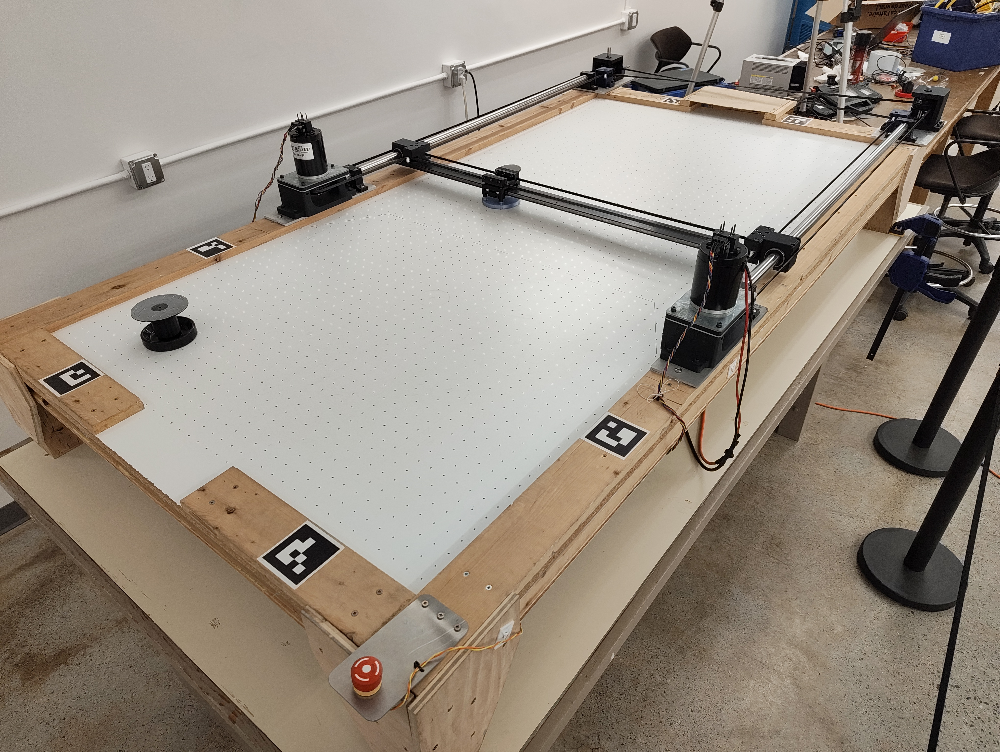

During aggressive motions, we observed **power-supply voltage sag**, leading to nonlinear behavior that made the system difficult to model accurately for simulation.  
To mitigate this, the previous team installed a **165 F supercapacitor** across the power rails to stabilize voltage under load.  
We later developed and documented a **safety procedure** for capacitor handling — [see here](https://docs.google.com/presentation/d/1C2lxZXDaFv2uMI581Z3ULeYxlSjX5ojVwfU028PKIhc/edit?usp=sharing).

---

### ⚠️ Mechanical & Electrical Issues

- **Mallet carriage height variation** — The cables attached to the carriage run *above* the sliding beam, creating a bending moment.

  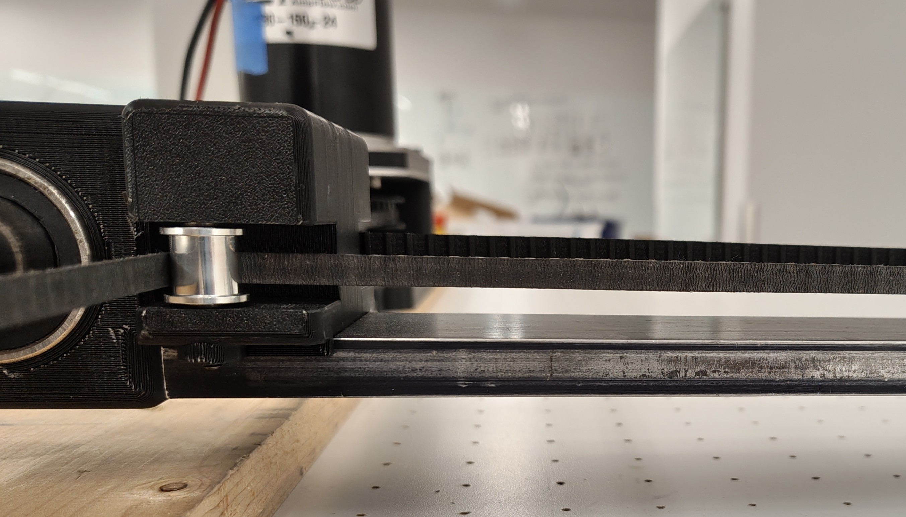
  
  This causes the mallet’s height to vary across the table. Since the mallet is positioned to avoid touching the surface to avoid friction, this bend in the beam makes it possible for the **puck to be trapped under the mallet**. Rapid belt tension changes also introduce **vertical vibration** and significant **audible noise** as the carriage impacts the table.

- **Table is not rectangular** — The table is not a perfect rectangle, with the width changing by around 4 mm. This causes more variation in the puck dynamics as the simulation assumes it is a rectangle.

- **Table flatness** — The table surface itself is not perfectly flat, complicating **camera calibration** and essentuating the problem with the mallet carriage height variation.

- **Wooden walls** — The table’s walls are made of wood rather than plastic, producing **high variance** in measured collision dynamics with location dependence. We noticed the wood also increases the chance of **puck ejection**.

- **Carriage looseness** — The original carriage was poorly constrained, causing **rattling**.  
  To resolve this, Ian redesigned the carriage to constrain all degrees of freedom and added slots for **shim adjustment**, enabling **≈50 µm precision** after 3D printing.  

  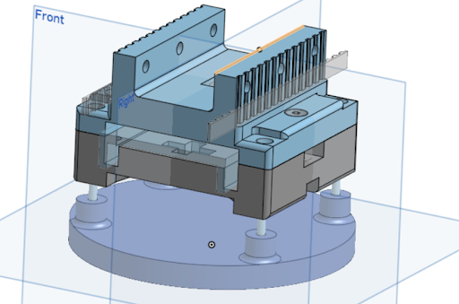

- **Electrical interference** — The electrical system produced large amount of E&M noise, causing **serial communication and motor encoder noise**, resulting in incorrect bytes being transferred. We replaced these with **shielded cables**, eliminating the issue.

- **Supercapacitor charge circuit** — The original **pre-charge and discharge resistors** were oversized, resulting in **hour-long wait times**. We replaced them with **1 Ω power resistors**, reducing delays dramatically.

- **Roller geometry** — The rollers guiding the timing belts have a **bend radius that is too small** for the belt specification.  
  This causes premature belt wear, reduced tracking accuracy, and increased mechanical noise during motion.

- **Mallet Material** — The robot's mallet was originally printed out of PLA, however the impacts with the puck were too powerful and ended up breaking the mallet. We reprinted the mallet with PETG, high infill, and cuboid structure which has proven to be more impact resistant.

---

### 🚀 Future Steps

To improve system reliability, accuracy, and maintainability, several mechanical and structural upgrades are planned:

- **Upgrade to a professional-grade air hockey table**. Currently the table we have can't truley be considered air hockey as it doesn't meet regulation standards and has very uncertain dynamics. If we were to get a pro player to compete against our AI, we would want a level, uniform table, with plastic sides and consistent dynamics.

- **Redesign the gantry beam and cable routing** to prevent bending caused by the belt and cable geometry.  
  Possible solutions include repositioning the cable guides below the beam or reinforcing the beam with lightweight carbon-fiber or aluminum bracing.

- **Re-engineer the roller assemblies** with a **larger bend radius** or replace them with **idler pulleys** that match the belt’s minimum recommended curvature.  
  This will reduce mechanical stress, vibration, and belt fatigue.

- **Change mallet material**. Instead of 3D printing the mallet, we would like to attach a standard air hockey mallet to the mallet carriage, allowing for better collision dynamics.

These improvements would provide a more robust and consistent physical platform for reinforcement learning experiments, simulation validation, and long-term autonomous gameplay testing.

</details>


<details>
<summary>🎯 Computer Vision</summary>

Our computer vision system enables precise tracking of the puck and opponent mallet using a single camera placed on a tripod.

### Lighting and Puck Detection

Previous teams struggled to detect the puck without modifying it (e.g., adding LEDs).  
We solved this by applying **retroreflective material** to the puck and mounting a **high-intensity LED array** coaxially with the camera.  
This setup reflects light directly back to the lens, producing a **high-contrast puck image** even at 100 µs exposure, eliminating motion blur during high-speed play.

Camera View:

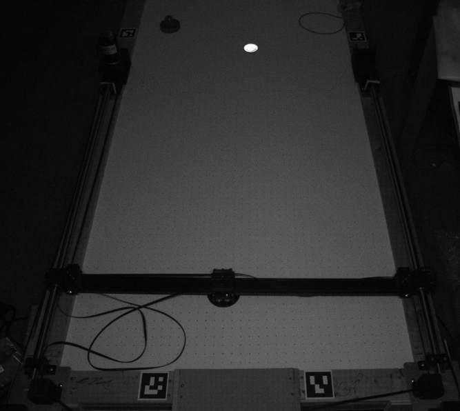

Retroreflective Tape Diagram, visualizing how it reflects light directly back to the source:

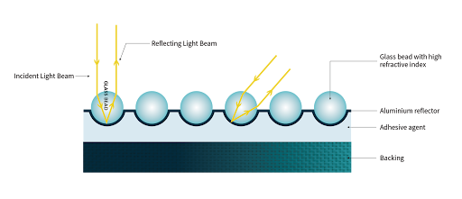

### Camera Calibration

Standard calibration techniques are to determine the camera's intrinsic matrix and use measured location of ArUco marker position to determine the camera's location and orientation in space. Below is the camera's view where the 6 markers around the edge of the table being the ArUco markers:

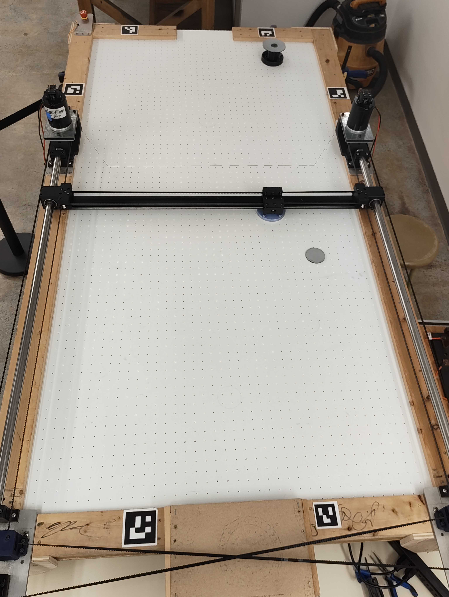

However, as the table is non-planar and large, we can not precisly measure the exact position of the ArUco markers and so standard calibration techniques failed.  
Instead we developed a **multi-view optimization procedure** that simultaneously solved for:
- The **3D positions of ArUco markers**, and  
- The **table surface height**, modeled as a second-order polynomial.  

Once the optimization proceedure was complete, we could then place the camera anywhere we desired and run a standard calibration technique to get the projection matrix. This approach enabled accurate mapping from image coordinates to real-world positions, achieving **~1 mm mean error** across the table. 

### Puck Tracking and Occlusion Handling

When the puck passes beneath the gantry, partial occlusion prevents simple centroid detection.  
To address this, we implemented a **contour-based tracking algorithm** that:
1. Projects visible puck contours to world space  
2. Generates multiple center candidates from the contour shape  
3. Selects the most consistent candidate based on geometric conformity  

This maintains reliable tracking even when a majority of the puck is hidden by the structure. There are instances where the puck is fully occluded, in these cases we set the puck position to the previous puck location instead of trying to estimate the position, this is implemented into the simulation allowing the RL agent to do the prediction.

### Opponent Mallet Tracking

We designed a lightweight **retroreflective mallet attachment** with a hollow center, producing a distinct contour from the puck.  
Two attachment variants support different playing styles (standard and low-profile).  
By detecting concentric contours, we can differentiate between puck and mallet and estimate both positions using the same calibrated camera system.

### 🏅 Key Achievements
- Achieved **robust, high-speed puck tracking** with **sub-millimeter precision**
- Developed a **calibration pipeline** resilient to table warping and uneven surfaces  
- Enabled **single-camera tracking** of both puck and mallet at 120 FPS  
- Fully passive optical system — **no modification to the puck or table electronics**

---

For a full description of the calibration math, optimization routine, and occlusion-robust tracking algorithm, see the [Final Report](link-to-report).

</details>

<details>
<summary>🧩 System ID</summary>

- <details>
  <summary>Mallet System ID</summary>

  ## Mallet System Identification

  To accurately simulate the environment, we needed to model the **mallet and puck dynamics**.  
  The mallet motion can be characterized as a **third-order transfer function** relating motor voltage to mallet position

  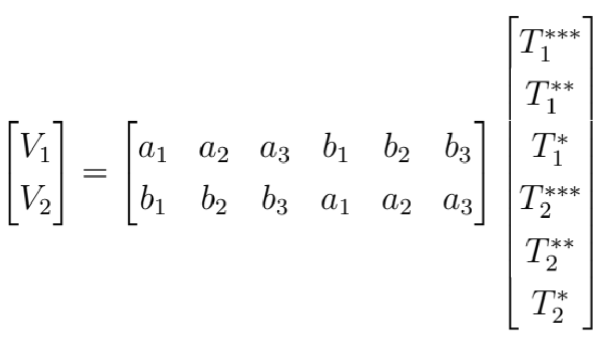

  We can then map this into two SISO systems, with the Cartesian control voltages as:

  <p align="center">$V_y = -V_1 - V_2 = \frac{2}{R} \left[ (a_1 + b_1)\dddot{y} + (a_2 + b_2)\ddot{y} + (a_3 + b_3)\dot{y} \right]$</p>

  <p align="center">$V_x = V_1 - V_2 = \frac{2}{R} \left[ (a_1 - b_1)\dddot{x} + (a_2 - b_2)\ddot{x} + (a_3 - b_3)\dot{x} \right]$</p>

  ### Parameter Identification

  Using encoder data for position and measured voltages \( V_x, V_y \), we performed parameter identification in MATLAB. The code for this section was written by Mauro.

  The identification process involved:
  1. Splitting the trajectory data into **short path segments**.  
  2. For each segment, fitting a small polynomial to obtain the initial conditions.  
  3. Running an optimization over parameters \( a_1, ..., b_3 \) to minimize the mean squared error between simulated and measured motion.

  Only segments with a strong polynomial fit were used in the optimization.

  ---
  
  ### Feedforward and Feedback Control
  
  With the identified transfer function, we implemented **feedforward control** — generating voltage profiles that would ideally produce a desired mallet trajectory.
  
  However, due to nonlinearities (e.g., friction, backlash, and voltage saturation), the pure feedforward model was insufficient.  
  We therefore added **feedback control** with PID.
  
  To find the optimal feedback coefficients for PID in simulation:
  - We tuned the PID controller to follow x - x^ (the actual minus expected path) from data collected
  - Feedback voltages were then mapped to a change in position using the feedforward model previously identified
  - The loop modeled realistic factors such as voltage limits, delay between control updates, and the Blue Pill microcontroller’s control period.
  
  ---

  ### Results
  
  Combining feedforward and feedback control yielded **millimeter-level tracking accuracy** relative to the reference trajectory.
  
  This model forms the foundation of the simulated environment and ensures that reinforcement learning agents experience realistic, physics-based dynamics.
  
  </details>

- <details>
  <summary>Puck System ID</summary>
  
  ## Puck ODE

  To accurately simulate the air hockey environment, we needed to model the puck dynamics and collision behavior.  
  The puck motion can be described by a simple nonlinear ordinary differential equation:

  <p align="center">$m \ddot{x} = -f - B \dot{x}^2$</p>

  where  
  - \( m \) is the puck mass,  
  - \( f \) represents friction, and  
  - \( B \) is a drag coefficient term related to air resistance.
  
  We fit this model to the motion data obtained from tracking the puck. The parameters were estimated using nonlinear regression to minimize the mean squared error between the observed and predicted trajectories. The optimization code here was written by Ian.

  ---
  
  ### Modeling Collisions
  
  Modeling the puck’s collisions with both the mallet and the walls proved more complex.  
  Initially, we modeled collisions using two separate restitution relationships:
  - Normal restitution as a function of incoming normal velocity, and  
  - Tangential restitution as a function of incoming tangential velocity.
  
  However, the real data exhibited significant variation, suggesting that the normal and tangential components were **not independent**.
  
  To better capture the behavior, we modeled the **output velocity and angle** as a function of the **input velocity and impact angle**.  
  Since no simple analytical function fit the data well, we instead trained a small neural network with **112 parameters** and **Softplus activations** to approximate the mapping.

  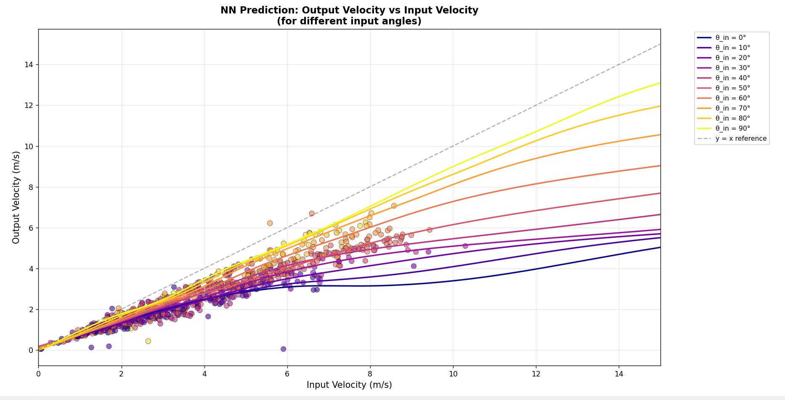
  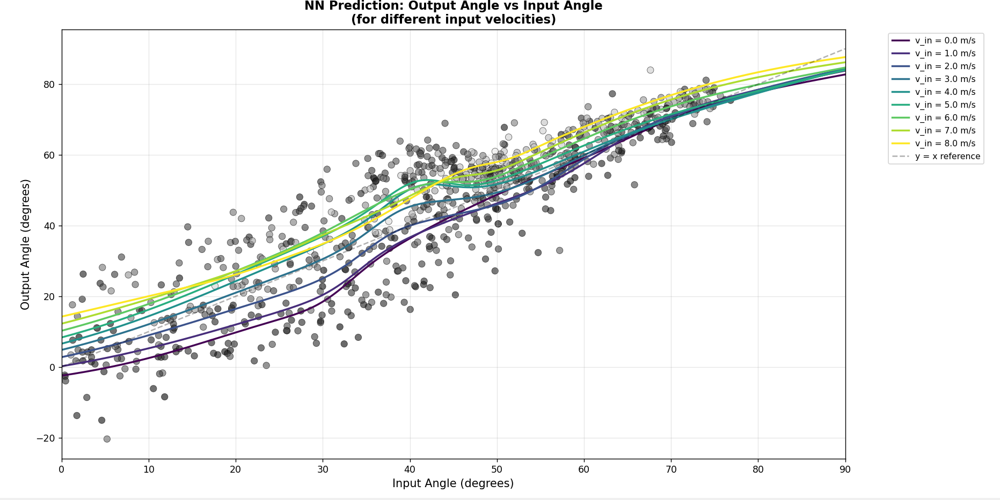
  
  The network also produced **heteroscedastic outputs**, meaning it learned to predict both the expected value and the uncertainty (standard deviation) for each output dimension.

  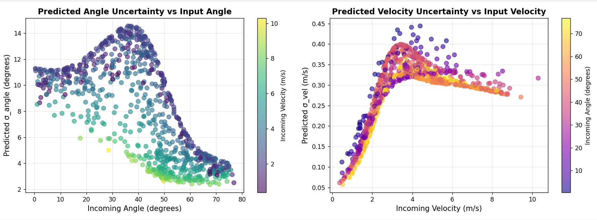
  
  ---
  
  ### Data Processing
  
  The collision dataset was built from filtered puck trajectories:
  1. We first identified segments where the puck trajectory could be fit accurately by a linear model over time.  
  2. Adjacent linear segments were extrapolated to detect potential intersections — either with a wall or a mallet.
  3. If the intersection occurred near a wall, it was labeled as a **wall collision**; otherwise, if it occurred near the mallet position, it was labeled as a **puck–mallet collision**.
  
  For each mallet collision:
  - The mallet trajectory was fitted using a polynomial within a 30 ms window.  
  - The exact contact point was found by minimizing
    <p align="center">$| \| P_\text{puck} - P_\text{mallet} \| - (r_\text{puck} + r_\text{mallet}) |$</p>
  
  We then transformed all collision data into the **mallet frame of reference** and computed:
  - Incoming velocity and angle  
  - Outgoing velocity and angle
  
  This produced a large dataset used to train the neural network model.
  
  ---
  
  ### Extrapolation for Out-of-Distribution Data
  
  Since we could not experimentally capture high-velocity collisions, we augmented the dataset with **synthetic extrapolated samples** at higher speeds.  
  This ensured that the simulation remained stable and physically reasonable even in scenarios that extended beyond the training distribution.

  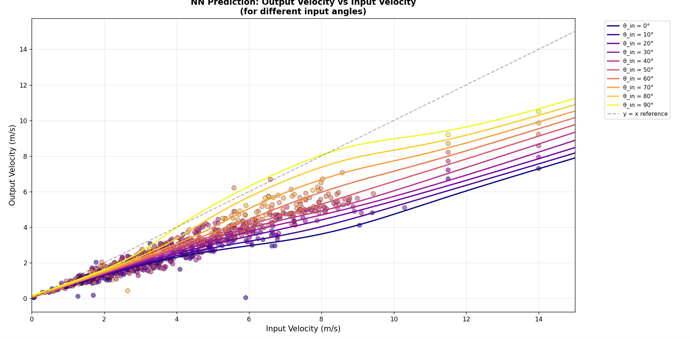
  
  ---
  
  ### Summary
  
  The resulting model captures both deterministic and stochastic aspects of puck dynamics:
  - The ODE models continuous motion under drag and friction.  
  - The neural network models nonlinear, uncertain collision responses.  
  
  Together, these models provide a realistic simulation of puck behavior suitable for reinforcement learning and physics-based gameplay.
  </details>

</details>

<details>
<summary>💻 Firmware and System Timings</summary>

## System Architecture

The system runs on Ubuntu 22.04 with real-time kernel flags enabled, coordinating three main components:
- **Laptop**: Processes camera input and Blue Pill data, runs neural network
- **Blue Pill**: Reads mallet position and communicates with motor encoders via SPI
- **Camera**: Captures table state at 120 fps

## Serial Communication Protocol

### Blue Pill → Laptop (Mallet Position)

To minimize serial bandwidth while maintaining reliability, we implemented a custom encoding scheme:

- **Data Encoding**: Float values are scaled to `int16` range before transmission
- **Packet Structure**: 
  - Start flag: `0xFF 0xFF 0xFF`
  - Data payload (scaled `int16` values)
  - End flag: `0x55`
  - Checksum: NAND of all data bytes

**Noise Resilience**: If data contains `0xFF`, it could be mistaken for part of the start flag. To prevent this, any least significant byte equal to `0xFF` is reduced to `0xFE`. This sacrifices at most 1 LSB (~50 microns), which is negligible compared to the reliability gain.

### Laptop → Blue Pill (Control Parameters)

Voltage curve parameters are sent via UART with `\n` as start/end delimiters, also including a NAND checksum. The Blue Pill buffers incoming serial data before processing.

## Camera Configuration

The camera streams BayerRG8 format with a reduced ROI to achieve 120 fps without exceeding USB 3.0 bandwidth limits. Grayscale was tested but requires on-camera RGB processing, significantly reducing achievable frame rates.

## Timing Measurements

Accurate delay measurement is critical for the simulation. Rather than measuring individual one-way delays (which requires clock synchronization), we use **round-trip timing**. The central idea here is not to measure the information delay from the event to when the neural network receives it, but instead the delay from the event to the neural networks action being preformed. In simulation, we can then treat the neural networks action as having no delay and set the information delay as the round trip delay.

### Mallet Delay
1. Blue Pill sends current timestamp (instead of dt)
2. Laptop processes through NN and path planning
3. Laptop echoes timestamp back in path variables
4. Blue Pill calculates: `current_time - received_timestamp = total_delay`

### Camera Delay
1. Blue Pill turns on LED with known timestamp
2. Laptop detects LED brightness in frame
3. Laptop processes preloaded table frame through entire pipeline
4. Blue Pill receives command and calculates delay
5. Result: Uniform distribution over (delay+[0, 1/120s]), where the lower bound is the actual camera information delay

All timing measurements include mean, standard deviation, min, and max values.

## Real-Time Performance

With code optimizations and the RT kernel, the main loop processes in **6-7 ms** (typical), though occasionally exceeds 8.5 ms. To prevent timing drift, the system runs at **60 Hz** instead of 120 Hz.

### Main Loop Sequence
```
1. Wait for camera data
2. Read mallet position from serial
3. Process NN action
4. Calculate Initial Condition based on previous command (accounting for command delay)
5. Calculate feedforward voltage profile, using initial condition and new command
6. Send instructions to Blue Pill
7. Capture next camera frame to buffer
8. Repeat at 60 Hz
```

### CPU Optimization
- Two CPU cores isolated for the main process
- CPU frequency locked to maximum
- Process pinned to isolated cores for consistent performance

</details>

<details>
<summary>🎮 Simulation</summary>

## Overview

The simulation is implemented in Python with full vectorization support, enabling parallel execution of multiple environments. Unlike traditional physics simulations that use fixed timesteps, this implementation leverages analytical solutions for significantly improved performance.

## Motion Model

### Mallet Control
Mallets move along paths defined by initial conditions, desired final position, and system parameters `M_Vx` and `M_Vy`. Each path corresponds to a voltage profile (see System Identification section):

<p align="center">$V_x(t) = M_{V_x} u(t) - 2M_{V_x} u(t-t_1) + M_{V_x} u(t-t_2)$</p>

Given the final position and system parameters, we solve for `t₁` and `t₂` to minimize overshoot and converge to the final position, xf. This formulation guarantees:
- All generated paths are physically achievable within system constraints
- The mallet never collides with walls
- The ODE has an analytic solution which is preprogramed and so no compute is used solving it

### Puck Dynamics
As derived in the System Identification section, puck motion satisfies a differential equation with a closed-form solution. Both mallet and puck positions are expressed as **explicit functions of time**—no iterative solvers required.

## Collision Detection

Collisions (puck-wall and puck-mallet) are detected by solving for when positions are the correct distance apart. While this lacks a closed-form solution, we:

1. Derive a **lower bound** on time-to-collision based on current actions and initial conditions (detailed in final report)
2. Step forward by this lower bound iteratively
3. Terminate when collision occurs or lower bound exceeds remaining simulation time

This approach guarantees no collisions are missed while maintaining large timesteps.

Collision responses are modeled using the heteroscedastic neural network described in the System Identification section.

## Performance Advantages

Traditional simulations use fixed `dt` timesteps, creating a trade-off between precision and speed. This implementation uses **dynamic timesteps** with several key optimizations:

1. **Analytical Solutions**: Both mallet and puck motion have closed-form solutions—no numerical integration needed
2. **Adaptive Timesteps**: High precision between collisions, large steps when positions change slowly
3. **Precomputed Paths**: Voltage profile restriction allows ODE solutions to be calculated once and reused
4. **Vectorized Execution**: Multiple environments run in parallel using NumPy operations

**Result**: Able to run the simulation at **450× real-time speedup** on an Intel i5 processor.

*Additional implementation details and derivations are provided in the final report.*
</details>

<details>
<summary>🧠 Reinforcment Learning</summary>
  
- <details>
  <summary>Markov Decision Process</summary>
  
  ## State Space
  
  The agent receives a comprehensive state representation designed to handle real-world timing delays and sensor limitations:
  
  ### Puck History Buffer
  A buffer of 5 historical puck positions at indices **0, 1, 2, 5, 11**, corresponding to approximate delays of:
  - 8 ms
  - 17 ms  
  - 25 ms
  - 50 ms
  - 100 ms
  
  **Rationale**: Direct velocity calculation is unreliable in certain scenarios (e.g., puck bouncing off corners). Providing raw positional history allows the network to implicitly infer velocity and acceleration.
  
  ### Opponent Information
  Historical opponent mallet positions at the same buffer indices (0, 1, 2, 5, 11).
  
  ### Agent State
  - **Mallet position**: Previous position (delayed—see Firmware and Timing section)
  - **Mallet velocity**: Calculated from delayed position data
  - **Previous action**: Ensures the MDP is fully defined, as `previous_action + past_position` determines current position
  
  ### Domain Parameters
  Current system identification coefficients `(a₁, a₂, a₃, b₁, b₂, b₃)` being used (see system id section). These are included because they vary across training domains (see Domain Randomization section).
  
  ## Action Space
  
  The agent outputs three continuous values:
  
  - **`xf`**: Desired final mallet position
  - **`M_{V_x}`**: Voltage parameter for x-axis motion
  - **`M_{V_y}`**: Voltage parameter for y-axis motion
  
  These define a trajectory as described in the Simulation Implementation section, guaranteeing physically feasible paths within system constraints.
  
  ## Reward Function
  
  ### Initial Approach (Sparse Rewards)
  Initially, rewards were:
  - **+1** if puck enters opponent's goal
  - **-1** if agent gets scored on
  
  **Problem**: Defense is easier than offense, making rewards extremely sparse and hindering learning.
  
  ### Improved Approach (Dense Rewards via Rollouts)
  
  When the puck crosses the halfway line toward the opponent:
  
  1. **Rollout Simulation**: Perform Monte Carlo estimation with 20 rollouts, assuming the opponent remains stationary
  2. **Reward Calculation**: 
     ```
     reward = E[success] × (20 + puck_velocity/2)
     ```
     where `E[success]` is the expected probability of scoring from the rollouts assuming the opponent does not move.
  3. **Episode Termination**: Episode ends when puck crosses halfway, but simulation continues without reset
  
  **Benefits**:
  - Dense reward signal for offensive play
  - Velocity bonus encourages aggressive shots
  - Continuing simulation (without reset) maintains diverse state distribution
  - Prevents reward hacking where agent only cares to shoot frequently just to trigger halfway-line rewards
  
  *Note: Collision outcomes include stochasticity (see System Identification section), necessitating the Monte Carlo approach for accurate reward estimation.*

  ---
  
  ## Training Opponents
  
  ### Self-Play
  The primary training method is **self-play**, where the agent plays against copies of itself. This creates a curriculum of increasing difficulty as the agent improves.
  
  **Limitation**: Self-play alone results in overfitting to a single opponent strategy.
  
  ### Diverse Opponent Pool
  To ensure robust performance, the agent trains against multiple opponent types:
  
  #### 1. Random Positional Agent
  - Selects a random area of the table (weighted towards the goal)
  - Moves randomly within that region
  - Provides unpredictable, non-strategic behavior
  
  #### 2. Defensive DQN Agent (~50k parameters)
  - **State space**: Same observation as the main agent
  - **Action space**: Three discrete actions (move left | move right | stay)
  - **Positioning**: Near goal line for defensive play
  - **Reward function**:
    - Negative reward proportional to opponent's expected success probability (encourages blocking shots)
    - Positive reward for reducing opponent's scoring chances
  - **Behavior switch**: When puck enters its side, switches to the main policy network for offensive play
  
  This opponent diversity prevents strategy overfitting and ensures the agent can handle various playing styles.
  </details>

- <details>
  <summary>Hyperparameters</summary>

  ## Network Architecture
  
  ### Policy Network
  A fully-connected deep neural network with **~1.8M parameters**:
  
  ```python
  Layer 1:  Linear(obs_dim → 1024) + LayerNorm + ReLU
  Layer 2:  Linear(1024 → 1024) + LayerNorm + ReLU
  Layer 3:  Linear(1024 → 512) + LayerNorm + ReLU
  Layer 4:  Linear(512 → 256) + ReLU
  Layer 5:  Linear(256 → 128) + ReLU
  Output:   Linear(128 → action_dim × 2) + ScaledNormalParamExtractor
  ```
  
  **Design notes**:
  - LayerNorm used in early layers for stable training with high-dimensional observations
  - Output layer produces mean and standard deviation for a Gaussian policy
  - `ScaledNormalParamExtractor` applies domain-specific scaling to action parameters
  
  ### Value Network
  Similar architecture to the policy network, used for advantage estimation with Generalized Advantage Estimation (GAE).
  
  ## Training Algorithm
  
  **Proximal Policy Optimization (PPO)** with the following hyperparameters:
  
  | Hyperparameter | Value | Notes |
  |----------------|-------|-------|
  | `lr_policy` | 5e-5 | Conservative to prevent divergence |
  | `lr_value` | 5e-5 | Matched to policy learning rate |
  | `gamma` | 0.997 | High discount factor for long-horizon planning |
  | `lambda` (GAE) | 0.7 | Balances bias-variance in advantage estimates |
  | `epsilon` (clip) | 0.05 | Tight clipping for stability |
  | `entropy_coeff` | 0.01 | Encourages exploration |
  | `batch_size` | 1024 | Large batches enabled by fast simulation |
  
  ### Design Considerations
  
  **Conservative Learning Rates**: Initial experiments with higher learning rates (>1e-4) led to rapid policy divergence. The low learning rate of 5e-5 provides stable, gradual improvement.
  
  **On-Policy Training**: While PPO is sample-inefficient compared to off-policy methods, the simulation's 450× speedup provides ample data throughput, making sample efficiency less critical. This allows us to leverage PPO's simplicity and stability.
  
  **Large Batch Sizes**: The vectorized simulation generates data quickly, enabling large batch sizes that improve gradient estimates and training stability.
  </details>

- <details>
  <summary>Domain Randomization</summary>
  
  # Domain Randomization

  To ensure the trained policy transfers robustly to the physical system, we apply extensive domain randomization based on empirically measured noise characteristics.
  
  ## Puck Position Noise
  
  ### Dual-Layer Noise Model
  Puck observations are corrupted with two noise sources:
  
  1. **White Noise**: Gaussian noise with standard deviation measured from stationary puck position variance
  2. **Perlin Noise**: Spatially correlated noise applied per-environment, with standard deviation based on calibration measurements of puck tracking accuracy vs. ground truth (see System Identification)
  
  ### Occlusion Handling
  When the puck is partially occluded by support beams:
  
  - **Partial occlusion** (>0% covered): Different white noise standard deviation, measured empirically
  - **Full occlusion** (>50% covered): Probability of detection failure, in which case the puck buffer repeats the previous frame's data
  
  **Note**: In reality, only 100% covered causes detection failure. However, since camera placement varies during setup (changing occlusion angles), this conservative approach ensures resilience to different configurations.
  
  Occlusion zones are approximated based on camera positioning geometry.
  
  ## Mallet State Noise
  
  - **Position noise**: White noise added to mallet position observations, standard deviation from measured sensor data
  - **Velocity noise**: White noise added to calculated mallet velocity, based on empirical measurements
  
  ## Action Execution Noise
  
  The feedforward + feedback control system does not perfectly track desired paths (see System Identification). To model this:
  
  1. Add white noise to the agent's output `Vx` and `Vy` parameters
  2. Standard deviations determined by:
     - Segmenting real vs. expected trajectories into small path segments
     - Optimizing each segment to find the `Vx`, `Vy` that best explain the actual motion
     - Computing standard deviation across all segments
  
  This ensures the agent experiences realistic path-following errors during training.
  
  ## System Dynamics Randomization
  
  ### Feedforward Coefficients
  Domain randomization is applied to the feedforward coefficients `(a₁, a₂, a₃, b₁, b₂, b₃)`. Critically:
  
  - **Agent observes its own coefficients**: The current domain's coefficients are provided as part of the state
  - **Opponent coefficients are hidden**: The agent does not know the opponent's dynamics
  
  **Benefits**:
  - **Adaptability**: If hardware changes shift system dynamics, new coefficients can be provided without retraining
  - **Strategic diversity**: Agent faces faster and slower opponents, learning to counter different playstyles
  - **Preparation**: Must plan for uncertainty in opponent capabilities
  
  ### Timing Delays
  All timing delays are randomized according to measured distributions (see Firmware and Timing section):
  - Mean delay
  - Standard deviation
  - Min/max bounds
  
  This ensures the agent learns to act effectively despite information latency.
  </details>

</details>
